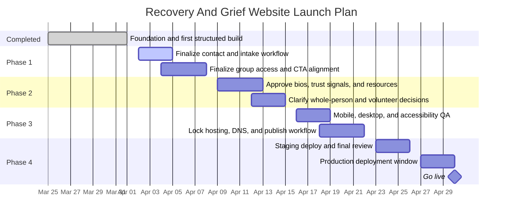

# Release Roadmap

## Planning Basis

This project is small in code footprint and moderate in launch coordination. The site already has:

- 7 public HTML pages
- 1 shared stylesheet
- 1 shared JavaScript file
- a working local preview workflow
- a prepared `publish/` deployment copy
- launch, QA, and hosting documentation already in place

That means the remaining work is mostly content approval, trust-building detail, QA, and deployment operations rather than large-scale engineering. For that reason, a 4-week launch program with 1-week phases is the best fit.

## Recommended Delivery Cadence

- Start date: April 2, 2026
- Target deployment date: April 30, 2026
- Working rhythm: 1 weekly planning check-in, 1 stakeholder approval check, 1 end-of-week QA review
- Deployment condition: this schedule holds if approvals on contact details, bios, group access, and hosting are not delayed by more than a few days

## Phase Program

### Phase 0: Foundation Complete

- Dates: March 25, 2026 to April 1, 2026
- Status: complete
- Goal: finish the first structured build and get the project into launch-prep shape

Delivered:

- multi-page static site structure
- shared design system and responsive behavior
- local preview workflow
- design-lab support tooling
- agile, product, and operations documentation

### Phase 1: Support Pathways Lock

- Dates: April 2, 2026 to April 8, 2026
- Goal: remove the main launch blockers tied to direct support access

Must finish in this phase:

- finalize the primary contact route in `connect.html`
- define first-response expectations and intake language
- finalize group participation instructions in `groups.html`
- align homepage and footer CTAs with the same primary contact route

Exit criteria:

- a visitor can clearly see how to reach a real person
- the one-on-one and group pathways no longer rely on placeholders

### Phase 2: Trust And Content Completion

- Dates: April 9, 2026 to April 15, 2026
- Goal: make the site feel real, safe, and complete enough for public launch

Must finish in this phase:

- replace placeholder team content in `about.html`
- add approved partner framing, logos, and trust details
- finalize curated resources in `resources.html`
- clarify the whole-person pathway in `whole-person.html`
- decide whether `help-others.html` launches now, is hidden, or is reframed

Exit criteria:

- placeholder language is removed from public pages
- trust-building content is consistent across the site

### Phase 3: Launch Readiness

- Dates: April 16, 2026 to April 22, 2026
- Goal: verify the final content and lock the publish path

Must finish in this phase:

- run full mobile and desktop smoke QA
- complete accessibility review on final content
- confirm final hosting choice, DNS plan, and maintainer access
- decide whether `design-lab.html` is excluded from the production build
- test the `publish/` workflow end to end

Exit criteria:

- no launch-blocking QA issues remain open
- the production publishing path is documented and tested

### Phase 4: Staging, Approval, And Deployment

- Dates: April 23, 2026 to April 30, 2026
- Goal: launch safely and leave with a clean stabilization list

Must finish in this phase:

- deploy a staging or preview build for final review
- collect one consolidated approval pass
- deploy to the live domain
- verify all internal links, external links, and contact routing in production
- capture post-launch fixes and follow-up improvements

Exit criteria:

- live website is working on the approved production domain
- the maintainer can repeat the publish process without guesswork

## Weekly Schedule

### Week 1: April 2 to April 8

- Lock contact workflow
- Lock group-access workflow
- Update CTA language on homepage, connect page, and footer

### Week 2: April 9 to April 15

- Approve bios and partner details
- Finalize resources and whole-person copy
- Make final decision on the volunteer page

### Week 3: April 16 to April 22

- Run QA on laptop and phone
- Complete accessibility checks
- Lock hosting, DNS, and publish workflow

### Week 4: April 23 to April 30

- Stage the final build
- Get final stakeholder sign-off
- Deploy and run production smoke checks

## Visual Timeline

## Milestones

- April 8, 2026: support-pathway blockers resolved
- April 15, 2026: public-facing trust content approved
- April 22, 2026: launch-readiness checks complete
- April 30, 2026: production deployment target

## Schedule Risk Notes

- The largest schedule risks are delayed approval of contact details, missing bios or logos, and late hosting or DNS decisions.
- If those approvals slip by more than 3 to 4 business days, move deployment by 1 week rather than compressing QA.
- Because the codebase is simple, it is better to protect review quality and content accuracy than to rush technical steps.
